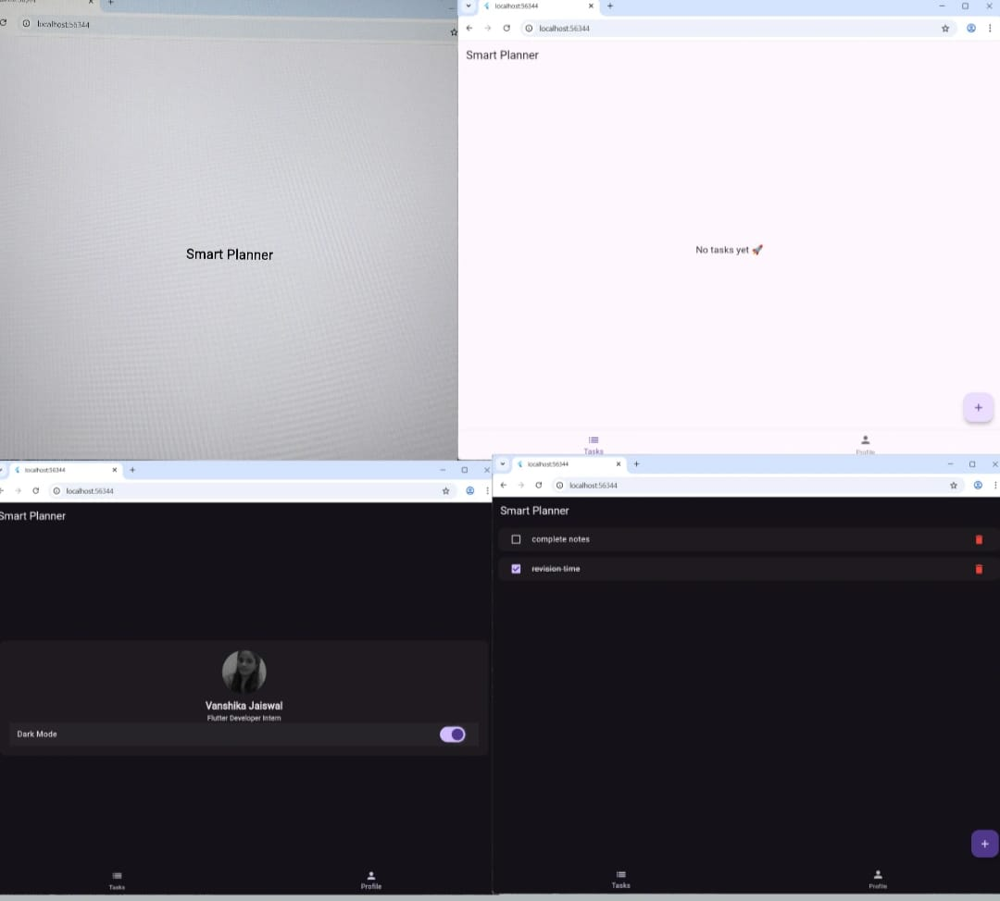

This is a multi-screen Flutter application named Smart Planner.

It helps users to add, view, complete, and delete daily tasks.

The app includes Splash Screen, Home Screen, Task Screen, and Profile Screen.

Tasks are stored using Shared Preferences, so data is not lost.

Users can mark tasks as completed using a checkbox.

It also supports Light Mode and Dark Mode for better user experience

## App Output

